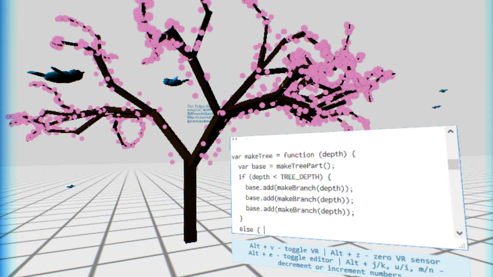

# Using Virtual Reality to Create Software: A Likely Future

I believe that software engineers could be more productive if they were able to work in a virtual reality (VR) environment.  Why? Firstly, VR enables software engineers to be completely surrounded in a truly three dimensional work environment, rather than being limited to a few 2D monitors in front of them.  Secondly, VR facilitates interaction such as head rotation that is both more familiar to users and more powerful than a traditional mouse and keyboard.

## What is Virtual Reality?
For those who aren't familiar with [virtual reality](http://en.wikipedia.org/wiki/Virtual_reality), it is a big step towards allowing humans to interact with digital equipment in ways that are more like the physical world. These  interactions more fully take advantage of the capabilities of the human body resulting in new creative opportunities and potentially resulting in higher productivity, lower learning curves, and increased user satisfaction.

### Depth
The Rift renders a slightly different image for each eye (this is called *stereoscopic rendering*) which allows humans to sense depth in the virtually images just like in the physical world. Previously, 3D scenes have been displayed on 2D monitors, now users can view 3D scenes in true 3D.

By rendering in true 3D, VR tools are able to engage our brain's spatial processing system more. Greater spatial engagement of our brains should result in increased productivity. 

For example, Data Mountain was a tool created to organize web bookmarks on a 3D inclined plane. The creators theorized that adding depth as well as the ability to move the bookmarks around would engage users' spatial processing more and thus result in improved performance. A study was conducted by Microsoft Research that showed that "storage times, retrieval times, and retrieval failures were all reduced because of this aspect of spatial memory's influence" ([academic paper](http://research.microsoft.com/apps/pubs/default.aspx?id=64329)).

I expect that VR tools will take advantage of this extra spatial processing and will result in increased developer productivity.

### Body Movement
There is a wide variety of devices that can sense the movement of the human body. These interactions allow users to have more freedom when expressing themselves which enables opportunities not yet seen.

Head mounted displays like the [Oculus Rift](https://www.oculus.com/) can sense head rotation and position. The [Leap Motion Controller](https://www.leapmotion.com/) is a thumb sized device that can sense hand and finger bones quite precisely when placed near your keyboard. The [Kinect camera](http://www.microsoft.com/en-us/kinectforwindows/) can sense arm, leg, and torso movements accurately. An omnidirectional treadmill like [Virtuix Omni](http://www.virtuix.com/) allows physical walking to translate to avatar movement. Body harnesses like the [Cyberinth](http://cyberith.com/) further allow crouching and jumping.

A lab experiment regarding brain-computer interfaces and VR was recently conducted in which participants brains were monitored while in a VR environment and asked to think about moving in the VR environment ([academic paper](http://www.ijircce.com/upload/2013/december/_16_dr_20A.pdf)).  The equipment caused the avatar's legs to move when it detected specific brain signals. The researchers found that 70% participants were able to completely walk down the virtual street merely by *thinking* about that movement.

Incorporating body movement gives users more freedom in how they interact with computers.

### Malleablility
One reason virtual environments are nice is because they are more easily changed than physical environments.  This results in virtual environments often being able to accomplish tasks more quickly and more cheaply than a similar task done in a physical environment.

#### Physical environment
Consider a situation where I needed to show the contents of a document I have memorized to another person. My constraints are that I do not have the document in front of me, the person is deaf, and I only have a pencil and a small sticky note. I decide to write down part of the document onto the sticky note, wait for the person to read it, then erase the sticky note and write down the next part of the file. I continue this until done.

#### Virtual environment
However, add a computer to the mix and the entire process becomes much faster and easier. The computer can write the contents of the file onto a small window the size of a sticky note, wait for the user to acknowledge they read it, then erase the contents of the note and write the next part of the file, repeating until finished. This virtual process is much faster and requires less work than the physical process.

VR combines the best of the physical world with the best of the virtual world and provides a new medium that blends the two together.

## Applications
Developers can take advantage of VR *now*, and if you don't seize the opportunity then someone else will get there first. Here are a couple prototypes for live coding and code review that concretely demonstrate how VR can help in software engineering. Use these prototypes as inspiration for creating your own software engineering tools that can use the advantages of VR as well.

### RiftSketch - Live Coding
[RiftSketch](http://www.youtube.com/watch?v=SKPYx4CEIlM) is a live coding environment built for VR which allows users to describe a 3D scene using [Three.js](http://threejs.org/).

Live coding, as [described by Tanimoto][Tanimoto:VIVA], is a way to describe an environment that allows a developer to edit a program while it is running. The traditional program development cycle involved the four separate phases: edit, compile, link, run. In live programming, there is only one phase, at least in principle. The phase involves the program constantly running, even as various editing events occur.

[Tanimoto proposes][Tanimoto:VIVA] that live coding is useful because it allows developers to see the effects of their changes much more quickly. This also helps developers to more easily identify which line of code caused a bug.

RiftSketch presents a user with a simple text editor, floating in front of them in an otherwise empty VR world. As the user types code into the editor, the world around them updates instantly to display the 3D scene dictated by their code. RiftSketch also allows the user to animate their scene via a callback function which is executed on every frame. The user can manipulate the state of the 3D scene in this looped block of code in order to add behaviour to the objects in their scene. This animation makes the user truly feel *inside* the scene in a way not captured by a 2D screenshot.

To assist in interaction with the keyboard, we allow reality to shine through by using a web camera mounted on the Rift and project that image in the system.
// TODO: add equipment pic and RiftSketch with webcam pic

#### Liveness
Although not unique to VR, liveness is greatly enhanced by it. RiftSketch demonstrates liveness by providing a tight feedback loop between code written and its effect in a virtual environment, and to quickly experiment with various solutions, algorithms and calculations. RiftSketch is also very promising as a learning tool since users can see their mistakes immediately and correct themselves without an intermediate compile step that might otherwise act as a hindrance. These benefits are especially evident in RiftSketch when the code describes a VR scene. Watching the entire virtual world change around you as you type can be an extremely powerful and engaging experience.

#### Hand Manipulation of Code
Furthermore, RiftSketch provides the user with shortcuts and input methods to quickly edit numbers in the code that they write. Integration with the Leap Motion Controller provides users with the ability to manipulate numbers using an up and down hand motion. This allows users to continuously modify a number using their hand and instantly see how this affects the scene, enabling faster feedback than the integrated keyboard shortcuts. Numbers in the code could represent anything, from the X, Y or Z components of a position or rotation vector, the red, green or blue components of an object's material or a component in the calculation of an object's animated speed.

#### Usage Example
Consider the following scenario: A space mission has just landed a probe on the surface of a comet. After 10 years in flight, the probe lands against all odds but in a position that is unable to receive sunlight. Automated telemetry programs cannot find a feasible flight path. As a programmer, you are tasked with updating the lander's software to reposition itself safely on solid ground and you have 24 hours before its batteries die and the probe deflects off the comet surface. Thankfully the companion orbiter has gathered detailed information about the surface around the landing site and telemetry data shows exactly where and how the lander is positioned.

You update your simulation with the data and step into RiftSketch to survey the situation. After assessing the lander's options, you iterate on possible solutions, first by using hand gestures to manipulate a possible path and scale thrust settings, and then the keyboard to refine the code. With each solution, you observe the lander's behavior inside RiftSketch. You walk around the lander to inspect its position after each maneuver, leaning in to ensure that its feet are planted firmly in the regolith, and zooming out to an orbital view to verify that its new position maintains a line-of-sight to the orbiter on this lob-sided comet. 

Finally, after having run the simulation dozens of times in RiftSketch, you pass the software on to review.

### Immersion - Code Review
Immersion represents methods as code fragments similarly to [Code Bubbles](video)and displays groups of fragments as piles on the floor like [BumpTop](video). Piles can be expanded into a 3D ring for reading and analysis. The ring uses semantic zoom to make method names readable even when at the back of the ring and the fragments retain a scaled height enabling the reviewer to approximate its length. 

// TODO: add pic of Immersion

#### Spatial Reasoning
The reviewer initially sees the active fragment in the center of the screen with other relevant fragments distributed around the floor in piles. Reviewers use spatial cognition to judge the relevance of piles by how far away the pile is as well as the size of the pile. The reviewer is able to scan the labels of the piles and number of fragments in each pile to quickly verify if each pile is indeed relevant.

Immersion divides the floor into sections based on packages of the system and color codes the sections to indicate how much that package has been modified by the code under review. By walking between packages, we expect reviewers to have better mental models due to the increased usage of spatial reasoning. Similarly, we expect that reviewers would be able to more easily recall review details after the review since the spatial elements of their brains were more engaged.

#### Gesture Interaction
Reviewers can make a grabbing motion to select a pile and then can pull their hand up to transform the pile into a ring of fragments for more detailed inspection. The reviewer is now able to read the foremost fragment in the circle and can make horizontal finger swipes to rotate the circle and read other fragments. The reviewer can pinch the foremost ring fragment on the top and bottom and move it to the middle of the screen to become the active fragment. If the reviewer wants to return to the previous method, they can move their hand as if clearing off a desk.

We have initially focused on supporting exploration--comments can be added via keyboard input, but we are investigating alternative ways to mark and flag code.

#### Usage Example
Consider the previous comet scenario where a programmer has implemented a repositioning flight path for the lander.

A reviewer puts on a Rift and enters Immersion to ensure this solution will actually work. She notes an edge case which might cause a collision and suggests gently crashing the companion orbiter into the probe to avoid a larger collision. The original programmer implements the suggestion in RiftSketch, ensures the simulation works and celebrates before submitting the correction to the reviewer. However, the reviewer sees a section of code light up in Immersion. As she walks over to the section she sees that it is the collision detection section warning that the system will not allow this code to execute outside of the simulator. She realizes she can allow the execution by shutting off the engine just before impact to override the system. They upload the code and the lander repositions itself as expected.

## Future Applications
There are plenty of developer activities that can benefit from VR, maybe you could be the one to implement one of these ideas!

### Simulation
Interacting with a simulation might require positioning a virtual cursor which can be challenging when you only have a 2D view of the scene. 

VR, on the other hand, allows users to view, explore and manipulate simulated worlds directly. One can imagine a user physically turning their head to look around a simulated car plant or using their hands, via a Leap Motion controller, to interact with a simulated robot. These direct interactions provide a subtle but important advantage over 2D-projected simulations. 
This sense of immersion gives the users unimpeded access to the simulation which allows for quicker turn-around when testing or debugging the simulated software, especially if combined with an in-situ live coding solution like RiftSketch.

In practical applications, one could extend the concept of live coding and tight feedback loops in order to create customized programming environments. VR programming environments could allow the user to take advantage of the malleability and expanse of virtual worlds. For example, a user could live code a widget that indicates some statistic of the code they are currently editing, such as the cyclomatic complexity, test coverage or test result. The widget would update itself as the user typed, not unlike existing code feedback tools such as [NCrunch](http://www.ncrunch.net/), and they could position the widget in their virtual periphery.

### Remote Collaboration
Co-located development teams are able to communicate in person. Distributed teams can try, but the technology is too slow and it doesn't feel right. [High Fidelity](https://highfidelity.io/) is implementing infrastructure for virtual worlds that is fast enough for developers to be able to sense body language and hear audio *in real time*. Distributed development teams will have the foundational issues of remote communication solved which enables a shared VR environment to become truly powerful.

Multiple programmers located around the world could join each other in a VR live coding space to figure out how to land the comet from the motivating example. They would be able to provide extra insight and could arrive at the solution faster.

A different set of programmers could then join each other in a VR code review environment to review the proposed solution. They are able to see what each person is thinking based on their annotations of the piles of information in their section of the system.

#### Pair Programming
A benefit of co-location is pair programming, where two developers program at the same computer and can catch each others errors. VR and body sensing with a device like [PrioVR](http://priovr.com/) would enable remote developers to be at a shared virtual desk right next to each other. They would be able to see the same files, talk in real time, and even point to which line of the code they are talking about. 

#### Pair Design
Co-located teams can design together around a whiteboard in a conference room as they talk through the problems of the system. A shared VR environment could have a similar room with sketching space that everyone can see. Developers could drag-and-drop files or code snippets to display on the walls around them. They could then discuss and annotate the code. Additionally, visualizations such as structure diagrams or architecture of related systems could be overlaid on a wall for reference.

#### Data Visualization
Remote workers could experience immersive visualizations together. A control flow graph could be represented by a maze of rooms through which the team could walk. The team members could trace different paths and yet still be shown an overlay of where each of the other members are and how these positions relate to each other. Currently remote workers can each trace separate paths of the code but have a hard time communicating what those paths are and how they relate to each other.

Remote workers often miss out on many benefits that in-person communication can bring. Shared VR spaces tailored to developers' activities can fill some of the gaps caused by distance and help the team to function better together. 

### Open Questions
Here are some big questions brought about by this topic.

#### Degrees of Immersion
Augmented reality devices such as Google Glass, aim to help the user complete tasks in the physical world by adding information overlays. Augmented reality seeks to help the user in the physical world while virtual reality seeks to completely replace physical reality. *Is it more useful to immerse the user in a completely virtual environment, or to enhance their physical world?*

#### Input Forms
Gaming console controllers work well for navigation and limited action support but are surpassed by keyboards at text entry. However, such devices require users to interact with both the physical and virtual worlds at the same time. Gesture recognition removes interaction with the physical world but can cause physical strain. Voice recognition could reduce strain but may feel awkward in a shared work space. *What is the best way for the user to provide input to a VR system?*

### Challenges

#### Separation from the Physical
Putting on a VR headset means blocking out the rest of the physical world, including coworkers. Peers may lack the opportunity to ask questions and physical communication is stifled. Additionally, the VR headset wearer may have trouble interacting with the physical world while in VR. A webcam mounted to the headset enables some interaction with the physical world, but has a limited field of view.

#### 3D Mapping
Some problems don't have an inherent 3D representation which makes display in VR a challenge. As seen in Immersion, 2D code can be displayed in VR but the code itself does not have a third dimension and thus loses the expressiveness of 3D. This could be an area well suited to 3D metaphorical programming as suggested by Andy Ko.

#### Technology Limitations
The 1080p resolution of the Oculus Rift Development Kit 2 allows for passable text reading, but needs improvement for multi-hour sessions. The Rift also requires users to measure the distance between their pupils for more accurate stereoscopic rendering, but current utilities are either time consuming or hard to use properly. Eyeglass wearers must go through extra trial and error to see if the headset is best used with glasses on and a reduced field of view or replace their glasses with stronger lenses in the Rift and have increased blurriness.

## Conclusions
Two-dimensional development environments have not been able to take full advantage of the human body.  VR is the next step towards a development environment that can effectively integrate true 3D rendering and physical body movement. Taking advantage of these things enables completely new opportunities in software engineering tools that have never been explored before. This opportunities can result in higher productivity, more creative opportunities, lower learning curves, and increased user satisfaction.

Developers who currently work with 3D scenes stand to benefit immediately from VR tools since the current approach of using 2D monitors negatively effects them the most.  Other software domains will benefit as well, but we need more people creating VR tools to make their investment worthwhile.

Virtual reality is here. What are you doing to help?

---
Thanks to [Brian Peiris](http://brian.peiris.io/) and [Chris Parnin](http://chrisparnin.me/) for contributing to this essay.

[Tanimoto:VIVA]: http://dl.acm.org/citation.cfm?id=1747286 "Tanimoto, VIVA"